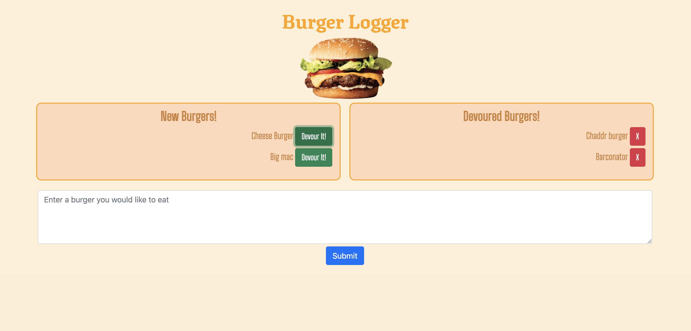

# Burger-Logger


## Description  
Burger logger with a minimalist design that implements [MySQL](https://www.mysql.com/), [Node](https://nodejs.org/en/), [Express](https://www.npmjs.com/package/express), [Handlebars](https://handlebarsjs.com/) and a homemade ORM that follows MVC design pattern. The server application is deployed on [Heroku](https://www.heroku.com/). 



    
## Table of Contents   
* [User Story](#User-Story)
* [Acceptance Criteria](#Acceptance-Criteria)
* [Installation](#Installation)
* [Usage](#Usage)
* [Credits](#Credits)
* [License](#License)
* [Tests](#Tests)
* [Questions](#Questions)

## User Story

```
AS A User
I WANT to be able to storage a list of burgers to be devaoured
SO THAT I can keep track of the burgers that I ate and the one waiting to be eaten. 
```

* Eat-Da-Burger! is a restaurant app that lets users input the names of burgers they'd like to eat.

* Whenever a user submits a burger's name, your app will display the burger on the left side of the page -- waiting to be devoured.

* Each burger in the waiting area also has a `Devour it!` button. When the user clicks it, the burger will move to the right side of the page.

* Your app will store every burger in a database, whether devoured or not.

## Acceptance Criteria

```
GIVEN a burger logger Application
WHEN I open the Burger Logger
THEN I am presented with a welcome page with a form 
WHEN I enter the name of burger and click on the submit button
THEN I am presented with a list of my burger on the left side with a devoured button 
WHEN I click on the `Devour it!` 
THEN the selected burger is moved to the right side with a delete button next to it
WHEN I click on the Delete button
THEN the burger is removed from the database

```

## Installation
1. Clone the repo.
2. Navigate to the project directory.
3. Run command ```npm install``` to install any dependencies.

## Usage    
* Navigate to the site.
* Enter the name of a burger.
* Click on the submit button.
* Click on the `Devour it!` button.
* Click on the Delete button.


## Credits  
Developed by: 
Manuel Leung Chen ([GitHub](https://github.com/manuelleungchen))

Deployment Tools used: 
* [Express](https://www.npmjs.com/package/express)
* [MySQL](https://www.mysql.com/)
* [Handlebars](https://handlebarsjs.com/)
* [Heroku](https://www.heroku.com/)

Development Tools used:
* [Nodemon](https://www.npmjs.com/package/nodemon)

## License
Copyright (c) 2020 - Manuel Leung Chen

Licensed under the [MIT License](https://choosealicense.com/licenses/mit/).
 
## Tests
1. Navigate to the project folder.
2. Type ```npm run watch``` command. 
3. Press Enter.

## Questions
Manuel Leung Chen - [GitHub](https://github.com/manuelleungchen )

If you have any question about this application, please reach out me by [Email](manuel.leungchen@gmail.com)

